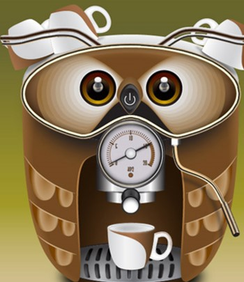

<p align="center">
  
</p>

# Project Directory Structure

```
.
├── data                <- data storage for different steps
│   ├── raw
│   ├── intermediate
│   ├── processed
│   ├── temp
├── notebooks           <- notebooks for explorations / prototyping
│   ├── eda
│   ├── cleaning
│   ├── training
├── results             <- storing results and outputs
│   ├── outputs
│   ├── plots
│   ├── models          <- Trained and serialized models, model predictions, or model summaries
└── src                 <- all source code, internal org as needed
```
